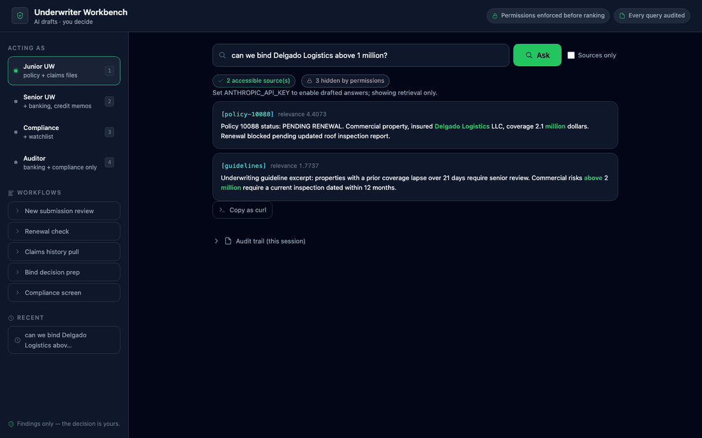

# Permission-Aware RAG: the technical tour

> The short version is in [README.md](README.md). This page is for engineers who want the mechanics.

**Retrieval-augmented generation that keeps documents the caller isn't allowed to see out of ranking, results and citations. It's enforced by construction (permissions are checked before ranking) and measured by a leak gate on every commit.**

[](https://github.com/kgorle1111/permission-aware-rag/actions)


A working vertical-AI product, not a toy: an **insurance underwriting workbench** where a
junior underwriter, a senior, a compliance officer, and an auditor ask the same question
and each sees only what their role permits — down to the ranking math. One structured LLM
call drafts cited findings on top; a human always makes the decision.

**The reference core is Python stdlib only.** No framework and no dependencies; every
security property is in ~600 lines you can actually read. The optional pgvector backend
adds `psycopg`, and the [`platform/`](platform/README.md) service adds FastAPI, Qdrant,
SQLAlchemy and PyJWT.



*The same question asked as Junior → Senior → Compliance → Auditor. Sources appear and
vanish with the role — a junior sees 2 sources with 3 chunks hidden; a senior sees the
banking and credit-memo files (4 sources, 1 hidden). The hidden-badge tooltip names the
missing data classes and who to escalate to. Static shot: [docs/workbench.png](docs/workbench.png).*

---

## The problem

Enterprise RAG has a well-known failure mode: the retrieval index doesn't know about
document permissions. Index everything, and any employee can phrase a query that surfaces
the salary file or the compliance watchlist — through the answer, the citations, or even
the *relevance scores* of documents they're allowed to see.

Most implementations "fix" this by post-filtering: rank everything, then drop forbidden
results. That still leaks — through score shifts, result ordering, and count side channels
tied to specific queries.

## The guarantee

This system prevents the leak by construction, instead of filtering after the fact:

1. **Pre-filtering** — chunks the caller cannot read are removed *before* ranking.
   Forbidden content is never scored, so it cannot influence ordering or citations.
2. **Visible-set statistics** — BM25's df / corpus-size / average-length are computed over
   the caller-visible set only, closing the subtler side channel where a hidden document's
   term frequencies shift the scores of visible ones. (This bug existed in v1 — it was
   found by an adversarial self-review, reproduced with a failing test, fixed, and the
   regression test asserts byte-identical scores with and without a hidden document.)
3. **A leak gate in CI** — a 20-case eval suite asserts, per role, both *expected* documents
   (recall@4: 14/14) and *must-never-return* documents (leak rate: 0). Any leak fails the
   build. Retrieval-quality changes (TF-IDF → BM25, chunking rewrite) merged only after
   this gate passed unchanged.
4. **Evidence that scales** — a frozen 210-doc generated corpus gives **0/1,350 leaks
   (95% upper bound 0.28%)**, and an isolation check (results must be identical to a
   corpus holding only the caller's readable docs) catches all 6 deliberately leaky
   retrievers in [`app/mutants.py`](app/mutants.py). Hand-labeled cases alone caught 1 of 6.
   [Results](evals/results/2026-10-03-v2/table.md) · [Threat model](docs/THREAT_MODEL.md) ·
   [Decisions](docs/DECISIONS.md) · [Roadmap](ROADMAP.md)

```
User question ──► ACL pre-filter ──► BM25 over visible set ──► top-k chunks
                     │                                            │
                     ▼                                            ▼
              hash-chained audit log              one structured LLM call (Haiku 4.5)
         (who / what / returned / denied)         grounded-only · citations required
                                                  citations verified post-hoc
                                                            │
                                                            ▼
                                          "Draft findings — verify before acting"
                                              (the human makes the decision)
```

## Try it in 60 seconds

[](https://render.com/deploy?repo=https://github.com/kgorle1111/permission-aware-rag)
&nbsp;— one-click free-tier deploy, or run it locally:

```bash
git clone https://github.com/kgorle1111/permission-aware-rag && cd permission-aware-rag/app
python3 run_evals.py                # the leak gate: 20 cases | recall@4: 14/14 | leaks: 0
python3 underwriter_server.py 8421  # open http://127.0.0.1:8421
```

No install step for the reference app: it's stdlib only. Switch roles with keys `1–4` and re-ask the same question:
sources appear and disappear with the role, and the UI explains exactly which data
classes are hidden and who to escalate to. Set `ANTHROPIC_API_KEY` to enable drafted
answers (~$0.002/query on Haiku 4.5; degrades gracefully to retrieval-only without it).

## Engineering highlights

For readers evaluating the engineering rather than the demo:

| Area | What's here |
|---|---|
| **Eval-driven development** | Retrieval changes gate on a per-role eval suite with *negative* assertions (must-not-return docs) — for a permissions product, the absence of a result is the spec. Runs in CI on every push. |
| **Prompt-injection boundary** | Retrieved text is framed in `<document>` tags and declared data-not-instructions; tested by inspecting the actual assembled API payload (mocked transport, zero spend). |
| **Hallucination containment** | Every `[doc-id]` the model cites is verified against the retrieved set; unverified citations are surfaced to the user, not hidden. |
| **Tamper-evident audit** | Each JSONL entry chains the previous line’s SHA-256; a separate `.head` checkpoint detects edits and tail truncation. Restart verifies both files and fails closed on mismatch. Rewriting both files requires an independently retained head to detect. |
| **Cost & latency receipts** | Every LLM answer returns `llm_ms` and `est_cost_usd` from real token usage; running totals per session. Value claims are measured, not estimated. |
| **Production seams** | SSO-ready: one env var switches identity from demo dropdown to HS256 JWT validation (constant-time compare, expiry) — `can_read()` untouched. Rate limiting, input caps, CSP/nosniff, XSS-safe rendering throughout. |
| **Prompt caching** | Static system prompt marked `cache_control: ephemeral`; per-request context deliberately uncached. Token usage surfaced per response to verify cache engagement. |
| **Test discipline** | Four test files: exact-content leak tests, role ACL tests, mocked-LLM payload tests, and HTTP endpoint tests against a real in-process server (auth, rate-limit 429s, CSV export). Plus ruff lint + format gating CI. |
| **Frontend** | Single-file vanilla-JS workbench on a token-based design system (dark + light, WCAG-checked), inline SVG icons, strict CSP with zero external origins. Deep links, keyboard-first, audit trail with CSV export. |

## Two backends, one guarantee

| | In-memory (default) | Postgres + pgvector |
|---|---|---|
| Ranking | BM25 (stdlib) | pgvector cosine over embeddings |
| ACL enforcement | Python pre-filter | **Postgres Row-Level Security** — the database refuses to return hidden rows even when an app query forgets its filter (not yet SQL-injection-proof: [T13](docs/THREAT_MODEL.md)) |
| Score side channel | Closed (visible-set statistics) | No analogue — embedding distance is per-row, no corpus statistics |
| Audit | Hash-chained JSONL | Hash-chained `audit` table |
| Dependencies | Zero | `psycopg` (`pip install -e ".[pg]"`) |

The pgvector backend ([`app/pgvector_rag.py`](app/pgvector_rag.py)) is the production
answer to "where should ACLs live?": in the database that already has them. Chunks carry
an `acl text[]`; an RLS policy admits a row only when it overlaps the caller's principals
(set per-transaction via a parameterized `set_config`); the app connects as a
non-superuser role, so with no principals set the table is *empty*. CI proves it with the
same 20-case leak gate plus an RLS-specific test: a raw `SELECT *` as the app role
returns only what the policy allows — no application `WHERE` clause involved.

Embeddings default to a deterministic stdlib feature-hash
([`app/embedding.py`](app/embedding.py)) so the whole path runs with no model and no
network; swap `embed()` for Voyage AI or sentence-transformers for semantic recall — the
RLS logic doesn't change. Run against the server with
`RAG_BACKEND=pgvector DATABASE_URL=postgres://... python3 underwriter_server.py`.

## The production platform ([`platform/`](platform/))

The root of this repo is the zero-dependency reference: small enough to read in one sitting.
[`platform/`](platform/README.md) is the same permission-before-ranking design built as a
deployable service:

| | Root (reference) | `platform/` (service) |
|---|---|---|
| API | stdlib HTTP server | FastAPI |
| Vectors | BM25 / pgvector + RLS | Qdrant + SQL store |
| Identity | demo roles / HS256 seam | RS256 JWT, verified per request |
| Source sync | static corpus | Google Drive delta + webhook, permission revocation |
| Tests | leak evals, mutants, isolation oracle | 304 tests, 98.85% branch coverage (≥96% gate), blocking mutation gate |
| Shipping | Render one-click | Docker image (non-root), container smoke CI |

The platform has its own CI in [`.github/workflows/platform.yml`](.github/workflows/platform.yml).
Its mutation gate is blocking: of 1,300 mutants, every survivor was either killed by a test
or recorded as a reviewed equivalent in [`platform/mutation_equivalents.json`](platform/mutation_equivalents.json),
pinned by source and mutant hash, so any new survivor fails the build.

## Threat model (what's handled, what's not)

| Vector | Status |
|---|---|
| Forbidden doc in results/citations | ✅ Prevented: excluded before ranking; 0/1,350 leaks in the scaled eval |
| Score side channel from hidden docs | ✅ Fixed — visible-set statistics; regression-tested |
| Prompt injection via document text | ✅ Bounded — data/instruction framing + payload tests |
| Hallucinated citations | ✅ Detected — post-hoc verification, surfaced in UI |
| Audit log tampering (edit/remove) | ✅ JSONL chain plus local head; pgvector checks stored line hashes |
| Audit log truncation from the tail | ✅ JSONL-only truncation detected against local head; ⚠️ pgvector truncation or rewriting both JSONL files needs external anchoring |
| Cross-doc aggregation (LLM synthesizes a conclusion no single doc supports) | ⚠️ Mitigated by citation-required prompting; needs answer-level evals |
| Denied-count side channel | ⚙️ Deliberate demo feature; `SHOW_DENIED=0` disables it |

## API

```python
from permission_rag import PermissionRAG

rag = PermissionRAG(audit_path="audit_log.jsonl")
rag.add_document("salaries", "salary bands range from 90k to 250k", {"group:hr"})

rag.retrieve("salary bands", {"id": "bob", "groups": ["hr"]}, k=3)  # → ranked chunks
rag.retrieve("salary bands", {"id": "alice", "groups": ["eng"]})  # → [] (never scored)

PermissionRAG.verify_audit_chain("audit_log.jsonl")  # checks chain + local .head
# For a stronger check, pass an independently retained expected_head=...
```

```bash
curl -s -X POST http://127.0.0.1:8421/ask -H 'content-type: application/json' \
  -d '{"user":"senior","q":"can we bind Delgado above 1 million?"}'
# → {"results": [...], "answer": "...", "llm_ms": 840, "est_cost_usd": 0.0019,
#    "unverified_citations": [], "denied_chunks": 1}
```

Full surface: `POST /query` (retrieval only), `POST /ask` (adds the drafted answer,
rate-limited), `GET /audit` (own queries; audit group sees others’ ids/counts with queries redacted; `&format=csv` neutralizes formula cells), `GET /presets`.
ACL entries are `user:<id>`, `group:<name>`, or `"*"`; empty ACLs and duplicate ingests
are rejected at write time.

## Scope and honest limitations

- **Ranking is BM25, on purpose.** The contribution is the permission model; `_score()` is
  one function to swap for embedding cosine, and the ACL logic doesn't change. The eval
  gate is what makes that swap safe.
- **Synthetic corpus.** Seven documents across four data classes, enough to demonstrate
  and test every property. In the reference app, the production path (ACLs from systems of
  record, IdP-issued JWTs, TLS) is designed and documented, not built. `platform/` builds
  part of it: RS256/JWKS identity and Google Drive permission sync.
- **Single-process.** Rate limits and cost totals are in-memory; the audit log is a local
  JSONL. Appropriate for the pilot scale this targets.

## Development process

This repo was built as a disciplined seven-wave cycle and the artifacts are public:
an adversarial security review of the first prototype ([`ROADMAP.md`](ROADMAP.md) — five
findings, two of which broke the product's core claim, all fixed with regression tests),
a product case file with a risk register ([`CASE_FILE.md`](CASE_FILE.md)), and an
integration map for fitting a real underwriting shop
([`INTEGRATION.md`](INTEGRATION.md)). Every wave shipped behind the test suite and the
eval gate; the commit history reads as the changelog.

## License

Apache-2.0

### Audit checkpoint compatibility

Keep `audit_log.jsonl` and its `.head` checkpoint together. Legacy logs without a
checkpoint are unanchored: startup rejects them without rewriting the history.
To preserve one, independently verify its provenance and linkage using
`verify_audit_chain(path, expected_head=trusted_head)` before provisioning the
checkpoint with that trusted digest. Do not compute a replacement checkpoint
from a log suspected of tampering. A crash between append and checkpoint update
also fails closed; recovery requires checking the log against trusted evidence.
The reference JSONL writer supports one process per audit file.

### AWS showcase deployment

The reference workbench has an [AWS Lightsail deployment](deploy/aws/README.md)
with private image uploads, managed HTTPS, one Nano node and a local smoke check
under its resource limits. It uses synthetic documents and retrieval-only answers.
The deployment script is prepared locally; a live URL is added only after AWS
verification. Audit history is ephemeral across container replacement.
