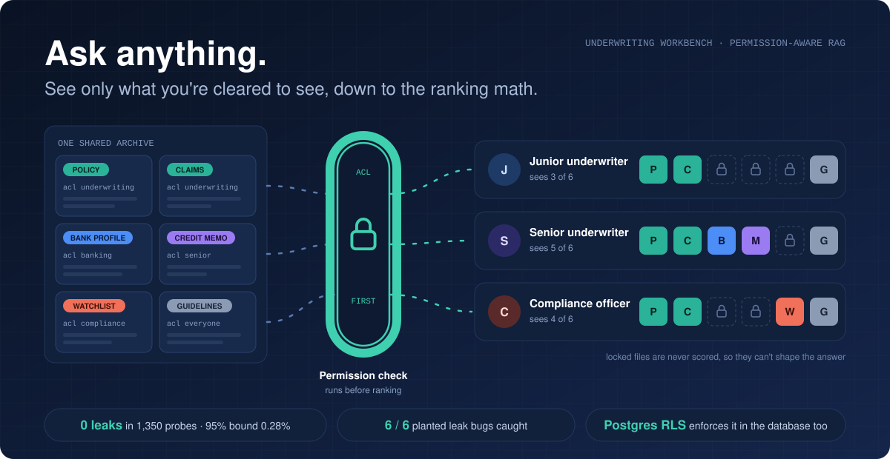
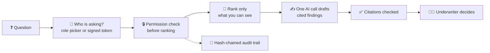

<div align="center">

# Permission-aware RAG: AI answers that only see what you're cleared to see



[](https://github.com/kgorle1111/permission-aware-rag/actions/workflows/ci.yml)
[](https://github.com/kgorle1111/permission-aware-rag/actions/workflows/platform.yml)


**The full technical tour: [README-technical.md](README-technical.md)**

</div>

## 🚦 The one-minute pitch

Every company wants to point AI at its documents. The catch is that not everyone is allowed
to read everything. An AI assistant that has indexed every file can leak the wrong one
through its answer, through a citation, or more quietly, through the way it ranks the
files you *are* allowed to see.

This project is an **underwriting workbench** that closes that leak at the root:

1. 🔒 **The permission check runs before search ranks anything.** Files you can't read are never scored.
2. 📐 **Ranking math only counts what you can see**, so a hidden file can't nudge the results.
3. ✍️ **One AI call drafts cited findings**, and every citation is checked against what was actually retrieved.
4. 🧾 **Every question lands on a tamper-evident audit trail**: who asked, what came back, what was withheld.

The AI drafts. The underwriter decides.

## 🎬 See it run


The same question, asked as a junior underwriter, a senior, a compliance officer and an
auditor. Sources appear and vanish with the role, and the UI says which data classes are
hidden and who to escalate to.

## 🧨 The problem we kept finding

The obvious fix is to search everything, then drop what the user can't see. **It still
leaks.** Hidden documents shift the relevance scores of the visible ones. That exact bug
was in this project's first version. An adversarial self-review found it, a failing test
reproduced it, and a regression test now proves scores are identical with and without a
hidden document.

Then we tested our own test. The original leak check was 20 hand-written cases, and it
reported zero leaks. So we planted six realistic leak bugs in copies of the retriever:
- no permission filter at all
- statistics computed over hidden files
- filtering after ranking
- `*` treated as "public" anywhere in a group name
- group names matched by prefix
- a results cache shared between users

**The hand-written check caught 1 of the 6.** A green test that has never been seen to fail
proves very little.

## 🧪 We measure, and we publish the "no"

So we built evidence that can fail:

| What we checked | Result |
|---|---|
| Leak probes on a frozen, hashed 210-document corpus (in-memory search) | **0 of 1,350** |
| The same probes against Postgres with row-level security | **0 of 1,350** |
| Planted leak bugs caught by the original hand-written check | 1 of 6 |
| Planted leak bugs caught with the new isolation check | **6 of 6** |

In plain numbers: **0/1,350 leaks (95% upper bound 0.28%)**, and the hand-labeled gate
still holds at recall@4: 14/14 with zero leaks. The isolation check needs no labels. For
every role, the results over the full archive must be identical, scores included, to the
results over an archive holding only that role's files.

Kept on purpose: the corpus is synthetic, probes reuse the documents' own wording (so this
measures exact-wording recall, not semantic recall), and the probes aren't independent.
A real-world document set is next on the [roadmap](ROADMAP.md).
[Full results](evals/results/2026-10-03-v2/table.md) · [pre-registered claims](ROADMAP.md#pre-registered-claims)

## 🔭 How it flows



## ✨ Why it's different

| | |
|---|---|
| 🔒 **Permission first, not filter after** | Forbidden text never enters ranking, so it can't shape the answer, the order or the citations. |
| 🐘 **The database enforces it too** | In the Postgres backend, row-level security returns only permitted rows, even if a query forgets its filter. |
| 🧪 **Tests that are proven to fail** | Planted leak bugs, a 1,300-mutant mutation gate, and docs that break the build when they drift from the code. |
| 🧾 **Receipts on every answer** | Latency and estimated cost per answer (about $0.002 on Claude Haiku 4.5), plus an audit log that detects edits. |

## 🧑‍💼 What this shows, if you're hiring

- **Security-minded AI engineering:** permission-aware retrieval, a prompt-injection boundary, citation verification and a written [threat model](docs/THREAT_MODEL.md) where each row names its test.
- **Evals before opinions:** pre-registered claims, confidence intervals, and negative results published next to the positive ones.
- **Production engineering:** a FastAPI service in [`platform/`](platform/README.md) with RS256/JWKS identity, Google Drive permission sync, a non-root Docker image and container smoke tests in CI.
- **Product judgment:** a [case file](CASE_FILE.md) with a risk register, an [integration map](INTEGRATION.md) for a real underwriting shop, and a [roadmap](ROADMAP.md) that lists what we chose *not* to build.

## 🛠️ How it's engineered

- **Two layers.** A reference core in Python stdlib only (~600 readable lines, no dependencies), plus [`platform/`](platform/README.md), the same design as a deployable service on FastAPI, Qdrant, SQLAlchemy and PyJWT.
- **Two search backends.** BM25 in memory, or pgvector on Postgres with row-level security. Both run the leak gates in CI.
- **304 platform tests at 98.85% branch coverage**, with a 96% floor enforced in CI.
- **A blocking mutation gate.** 1,300 mutants: every survivor is either killed by a test or pinned as a reviewed equivalent with a written reason.
- **Docs that can't drift.** Tests fail if a [decision](docs/DECISIONS.md), threat row or roadmap entry cites a test that no longer exists, or if this README's numbers stop matching a fresh eval run.
- **LLM hygiene:** one structured, grounded call; prompt caching on the static system prompt; graceful fallback to retrieval-only when the model is unavailable.

## 🚀 Try it in 60 seconds

[](https://render.com/deploy?repo=https://github.com/kgorle1111/permission-aware-rag)
&nbsp;one-click free-tier deploy, or run it locally (no install step):

```bash
git clone https://github.com/kgorle1111/permission-aware-rag && cd permission-aware-rag/app
python3 run_evals.py                # the leak gate: 20 cases | recall@4: 14/14 | leaks: 0
python3 underwriter_server.py 8421  # open http://127.0.0.1:8421
```

Switch roles with keys `1`–`4` and re-ask the same question. Set `ANTHROPIC_API_KEY` to turn
on drafted answers; without it, the workbench runs retrieval-only.

## 🧭 Honest limits

- **Synthetic data.** It hasn't been deployed at a real underwriting shop yet.
- **Row-level security stops a forgotten filter, not SQL injection.** The app's database role can still change its own session settings ([T13](docs/THREAT_MODEL.md)); a separate ingest role is on the roadmap.
- **Recall is measured on exact wording.** Semantic recall on real documents is unmeasured.
- **Cross-document reasoning isn't solved.** The AI could combine permitted files into a conclusion no single file supports. Citations and a human decision are the guard.
- **The newest audit entries can be deleted without detection.** Edits anywhere are caught, but trimming the tail isn't ([T12](docs/THREAT_MODEL.md)).

## 🗺️ What's next

- Security fixes, each with a failing test first: document-tag escaping, spreadsheet-formula-safe CSV export, tamper-evident newest audit entry
- Request logs for latency, cost and retrieval failures, plus a daily spend cap
- PII redaction, and an index that refuses a mismatched embedding model
- An eval on a real-world document set this project didn't write

Everything else: [ROADMAP.md](ROADMAP.md).

## 📄 License

Apache License 2.0. See [LICENSE](LICENSE).
